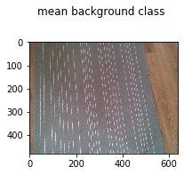
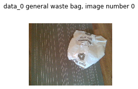
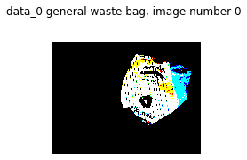

# challengeFromRecycleye

# Data set:

- Contains three classes [ 'general waste' [class 0], 'green sack'[class 1], 'mixed recycling'[class 2]
- 50, 43 and 50 samples respectively for 3 classes 0,1,2
- 7 background images (under different lighting conditions) is present 

# Observations
While designing a strategy, looking at the data and making observations is important. 
Here are some obseravations from the data
  - Most important information is the texture/colour of the bag
  - Bags share similar shapes, so shape info here is not going help
  - To deal with it, most important data are the distribution of RGB values

# Assumptions: 
- Camera is fixed
- Multiple bags may be present
- No overlap between bags
# Strategy: 

  - First step is removing the background because they are extra information here and casue unnecessary flow of data
  - How we do that? One simple way is to subtract the background (7 background images are provided under different lighting conditions, I have made a mean of them termed 'mean_back' in code)
  - When the camera is not fixed, then this strategy changes a bit. So, I will not have background class then, I can use background segmentation methods (may be otsu or adaptive thresholding or masking using a fixed threshold value)  

  - After the background info has been removed (they are mostly black), we have RGB values of images in scale of [0,1]. We need to use a threshold here to make them binary
  - Making them binary will enhance the required features (RGB information). 
  - After this binary RGB info has been generated, I count the number of RGB values activated at each image
  - So, for each sample, now I have 3 values [R, G, B] and they represent how many points in R, G, B channels is activated. 
  - With this info, Comparing with the background class, we can detect if the supplied data sample contains any bags/single bag/multiple bag (no data samples has been supplied for nultiple bags, but it can created by summing two samples from the supplied images after removing background). This detection/classification can be carried out using KNN classiier or by simple distance measuremtns.
  - If the test sample is classified as 'single bag', then the created KNN classifiers (k value is 2 here), can classify the bag as 'general waste' [class 0 in code], 'green sack'[class 1 in code], 'mixed recycling'[class 2 in code].

# What about a neural network(NN)?:
  - For NN (or a computer vision model as it is image data), more data is required. Since the data is limited, either we can go for transfer learning or heavy data augmentation
  - For such small dat set (training + testing), using NN may not be feasible. Still I have made an architecture of a fully Convolutional Neural Network for this data
  - The hyperparameters mentioned in the code are just a representation instead of actual values
